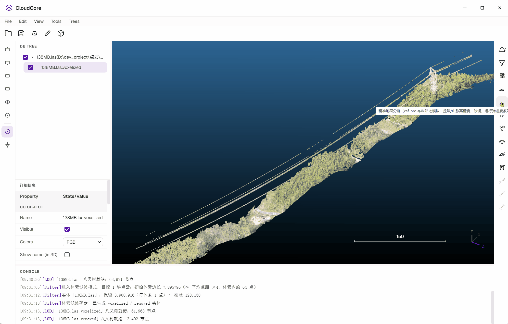
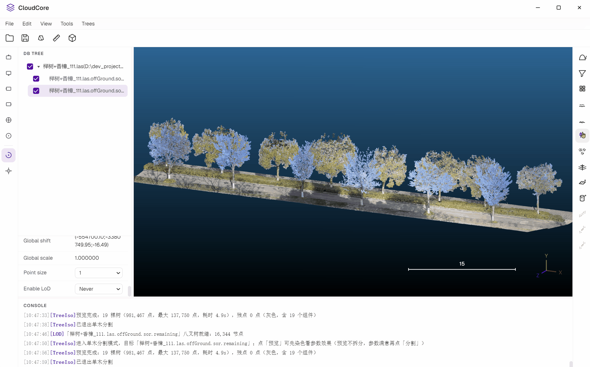

# CloudCore

**A desktop point cloud (LAS / PLY) viewer and processing tool for Windows.**

Airborne and terrestrial LiDAR scans come back as one soup of everything at once — ground, vegetation, buildings, power lines, pipes. CloudCore turns the raw file into deliverables: ground points, per-tree inventories, power lines, fitted planes and cylinders, registered clouds.

Rendering is three.js; the compute work lives in **13 C++ N-API native modules** (12 algorithms plus one LOD rendering infrastructure). They read and write three.js vertex buffers directly inside the renderer process — same address space, zero copy, no IPC and no serialization.

[](./LICENSE)


[中文](./README.md) ｜ **English**

---

**CSF ground segmentation**



---

**Core algorithms (C++ N-API native modules)**

- Ground segmentation `csf-lidar`: CSF cloth-simulation ground detection with airborne semantics (fast)
- Accurate ground segmentation `csf-pro`: cloth-draping semantics, high accuracy on hills and mountains, with progress and cancel
- Individual tree recognition / segmentation `treeiso`: three-stage graph cut, splitting every tree into its own entity inside a tree-item container
- Euclidean clustering `euclidean-cluster`: static KD-tree + parallel union-find, cutting merged objects apart by distance
- Power line extraction `powerline`: off-ground filter → per-point PCA → directional connectivity → parabolic-model stripping → endpoint completion
- Radius filter `radius-filter` / statistical filter `statistical-filter` / voxel downsampling `voxel-filter`
- RANSAC plane fitting `ransac-plane`: finds the dominant plane, checked against a 3D wireframe, repeatedly peelable
- RANSAC cylinder fitting `ransac-cylinder`: pipes / poles / trunks, with an automatically estimated or explicitly given axis
- Registration `registration`: point-pair coarse alignment (Horn quaternion, ≥ 3 point pairs) / ICP refinement / GICP face-to-face refinement

---

**CSF ground segmentation**


**Individual tree segmentation**



## Quick start

Requirements: **Windows** + Node.js + pnpm (the repository pins `pnpm@11.9.0` through the `packageManager` field, so corepack picks that version up automatically).

```bash
pnpm install
pnpm dev              # dev mode (HMR)
```

> The compiled native modules (`native/*/build/Release/*.node`) are **committed to the repository**, so a
> fresh clone works out of the box without a C++ toolchain. You only need to rebuild locally if you change
> the C++ sources under `native/`.

Package:

```bash
pnpm build:win        # vue-tsc + vite build + electron-builder (zip)
pnpm build:win:local  # same, but produces an NSIS installer and does not publish
pnpm build:test       # type check + Vite build only (what e2e runs against, no packaging)
```

## License

Some algorithms reference the public semantics of CC and PCL.
